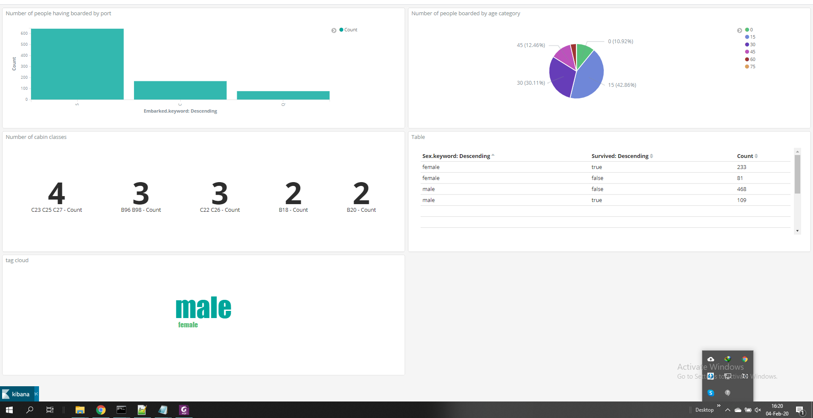

# A3--Elastic-Search-kabana-and-logstash (solution for Elastic Search exam held in EISTI,France )

## Problem 1. Data Visualization using Kibana
* Data : train.csv
* Go to https://www.kaggle.com/shivamp629/traincsv to understand the data in question
* Delete the first line of the train.csv (the one containing headers)
* Make a configuration file so Logstash can parse this file 
  * Warning: do not forget to convert data
* Create a file with log of logstash
* Create a dashboard which contains visualizations with at least this indicators (KPI)
      * Number of people having boarded by port
      * Number of people having boarded by age category (ex: [15-20])
      * Number of cabin classes
      * Number of survivors / or not by age category
      * List containing sex, survivor or not and the associated count
      * Use Visualisation : Tag Cloud to visualize the part of men/women
 
 * Solutions: [click here for solution](https://github.com/induraj2020/A3--Elastic-Search-kabana-and-logstash-Exam-Eisti-) 
   * Related files 1. Titanic_exam.log 2.Train.csv
   * Screenshot
      
      
## Problem 2. Logstash parsing and filtering
 * Data : apache_file_example
 * Understand the data in question
 * Make a configuration file so Logstash can parse this file
 * Create a file with log of logstash
